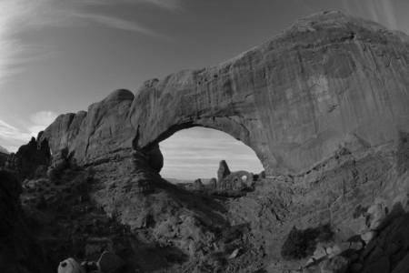
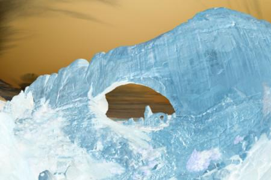

# PhotoFilter

Computers represent images as a sequence of numbers representing the intensity of primary colors in a given pixel. For images in the sRGB color space, each pixel of the image has three values associated with it: Red, Green, and Blue. Each of these values is between 0 and 255, and greater numbers represent higher intensity of the corresponding color in a given pixel. [This site](https://www.w3schools.com/colors/colors_picker.asp) has a simple applet that shows the relationship between RGB values and the resulting color. 

In this project, you will create image filters that modify the RGB values of pixels of a source image. 

## Overview of Source Files
This application provides a GUI for users to select a source image (`.jpg`, `.jpeg`, `.png`, and `.gif` are selectable) to which to apply one of list of filters. The original file is preserved, and the filtered image is written to a new file. The files in `src` are described below. 

- `PhotoFilter.java`: The main class of the application. Launches a GUI and manages control of user input to apply filters. 
- `Filter.java`: An interface that defines a filter for this application. All filters must implement this interface. 
- `GrayscaleFilter.java`: A sample filter that converts a source image to grayscale. 

     

- `NegavitveFilter.java`: A negative filter that inverts the colors of the image. Each pixel color value is replaced with 255 minus the original value. 

     

- `sample_images`: A directory containing a few high-resolution sample images you may use for testing. You should also find your own images to test your code. 
 
## Your Task
Your job in this project is to create three additional filters (i.e. three new classes) and add them as options in the PhotoFilter application. Comments of the form  

    TODO: STUDENT WORK 

indicate where you should add and/or modify code. Small changes should be made to `PhotoFilter.java` to make your new filters available to users. 

Your filters should create a easily noticeable change to the source image. You may use the two provided filters as examples for how to manipulate the image data, or you may try other techniques for modifying the images. Some examples of filters can be found on [this site](https://lodev.org/cgtutor/filtering.html), among others (_Note: this source is written in_ C)  
 
## Evaluation
Your project submission will be evaluated as follows. 
- (30 pts.) You have implemented three additional filters of your choosing in the program. Each filter should be a class that meaningfully implements the interface `Filter.java`. Each filter directly manages the image file provided to it (i.e. you do not simply call other filters). 
- (5 pts.) Each filter you created has been added to the GUI and can be correctly selected and applied to source images. 
- (5 pts.) You have completed student_readme.md to describe your approach to solving the problems you encountered while completing the project. This need not be a diary, but your approach should be clearly explained here.
    - Fully describe the effect of each of your filters and how that effect was achieved by modifying pixel data of the image. Include a written description and example pictures in your readme. 
    - What challenges did you face while completing the project? How did you address them?  
    - How did you test your code? Explicitly describe examples of your test cases. 
    - (Bonus 2 pts.) Provide suggestions of how you would improve the documentation, sample code, testing, or other aspects of the project (up to 2 points extra credit available for noteworthy suggestions here, e.g., actual descriptions of how you would change things, sample code, code for tests, etc.) You will not receive bonus points for simply reporting an issue - you should provide actionable suggestions on how to improve things   
    
## Optional Challenge
Provide more than three additional filters. Add as many as you like! For the challenge, try combining filters you made, and see what you can make! 

## Submission, AI, Late Policy
Please submit your project as a compressed folder __containing the entire project__ (i.e. not just the `src` folder) and submit it to the dropbox associated with the project assignment.  

This project is a solo project and should contain a representation of your understanding of the content. If you use an idea from another source (content or styling from another website, classmate, etc.) you must cite that source. Failure to do so is considered an AI violation. 

Late work will be accepted with a penalty of 5% for each day the submission is late (up to a maximum 30% penalty). 
    
